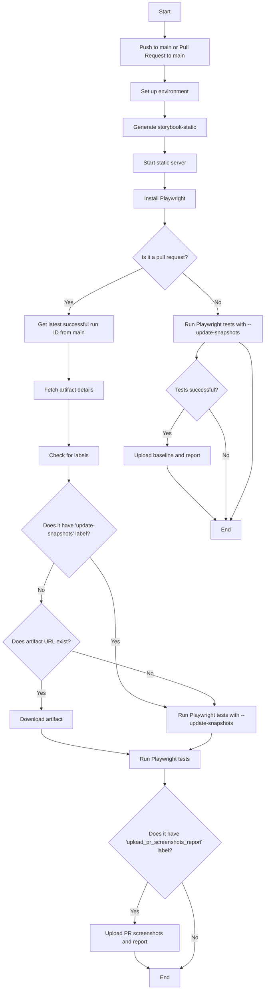

# Project Overview

This project is a Design System template of web components designed for use in various web applications. It focuses on creating reusable, performant, and easy-to-use UI elements, ensuring consistency and quality through automated testing and documentation.

## Summary

- [Technologies Explained](#technologies-explained)
  - [Lit](#lit)
  - [Storybook](#storybook)
  - [Web Components](#web-components)
  - [Tailwind CSS](#tailwind-css)
  - [Vite](#vite)
  - [Playwright](#playwright)
  - [Typescript](#typescript)
  - [GitHub Actions](#github-actions)
- [How Everything Works Together](#how-everything-works-together)
- [Regression Test](#regression-test)
- [Running the Application](#running-the-application)

### Technologies Explained

Below, is a brief explanation about each technology in simple terms, focusing on what it does and its role in the project:

- **Lit**: [Lit](https://lit.dev) is a library that helps build web components, which are custom HTML elements you can create yourself. It uses JavaScript and HTML templates to define how these elements look and behave, making it easy to create reusable pieces of a web page.

- **Storybook**: Storybook is a tool that lets us develop and test UI components separately from the main application. Think of it like a sandbox where you can see how each component looks and works, helping developers create and document them efficiently.

- **Web Components**: [Web components](https://www.webcomponents.org/introduction) are a set of web standards that allow you to create custom HTML elements with their own behavior and styles. They are part of modern web technology, ensuring your components work in any web page or application.

- **Tailwind CSS**: [Tailwind CSS](https://tailwindcss.com) is a way to style web pages using utility classes, like adding colors or sizes with simple commands. It helps style our components quickly and flexibly, keeping everything looking good without writing a lot of custom CSS.

- **Vite**: [Vite](https://vite.dev) is a tool that builds and compiles our code, making it fast and efficient for development. It helps turn our Typescript and component code into something browsers can run, with quick updates as you work.

- **Playwright**: [Playwright](https://playwright.dev) is a testing tool that automates checking if our components work correctly across different browsers. It ensures they look and behave as expected, including comparing screenshots to catch visual changes.

- **Typescript**: [Typescript](https://www.typescriptlang.org) is like JavaScript but with added type checking, which helps catch errors early. It makes our code more reliable and easier to maintain, especially for large projects.

- **GitHub Actions**: [GitHub Actions](https://docs.github.com/en/actions) is a system that automatically runs tasks like building and testing our code whenever we make changes. It ensures everything works before merging, storing test results for review.

- **GitHub Artifacts**: [GitHub Artifacts](https://docs.github.com/en/actions/using-workflows/storing-workflow-data-as-artifacts) are files generated during GitHub Actions workflows that can be stored and shared. For example, test results, screenshots, or build outputs can be saved as artifacts, making it easy to review or download them later. This is especially useful for debugging or sharing results with the team.

### How Everything Works Together

Developers write component code and stories, use Storybook locally to see and test them, build with Vite for production, and test with Playwright for functionality and visuals. GitHub Actions automates this, running tests on every code change to keep quality high.

Playwright can test across different browsers, ensuring your components look the same everywhere, which is crucial for web applications used globally.

# Regression Test

#### Project Overview and Purpose

The project is a system designed to automate visual regression testing for UI components, ensuring that any changes to the code do not introduce unintended visual differences. Visual regression testing is a type of testing that compares the visual appearance of an application before and after changes, helping to catch issues like misaligned elements, color changes, or other visual discrepancies that might not be caught by traditional functional tests. This is crucial for maintaining a consistent user interface, especially in projects with frequent updates.

The workflow is triggered on push events to the main branch and pull requests targeting the main branch, ensuring that both new code commits and proposed changes are tested for visual integrity. The goal is to have a setup free to start using GitHub Actions for CI/CD automation, with artifacts stored for review, that has a 10GB free. For larger projects this setup could not have enough space on GH artifiacts for visual regression tests, in this case consider using external libraries like [AWS S3](https://aws.amazon.com/s3/) or others services like: [Chromatic](http://chromatic.com)

#### Workflow Architecture and Process

1. **Triggering Event**: The workflow starts when someone pushes code to the main branch or creates a pull request to main. This ensures that both new commits and proposed changes are tested.

2. **Environment Setup**:

   - **Set Up Node.js**: It sets up Node.js version
   - **Install Dependencies**: Install dependencies using `npm`

3. **Build and Serve Storybook**:

   - **Generate Storybook-Static**: Runs `npx --yes storybook build -o storybook-static` to build Storybook into a static site and outputs it to the `storybook-static` directory. This static site contains all UI components in their various states, ready for testing.
   - **Start Static Server**: Starts a local HTTP server to serve the `storybook-static` directory on port 8080, making it accessible for Playwright to interact with, like opening a website locally.

4. **Baseline Management**:

   - **For Pull Requests**:
     - **Get Latest Successful Run ID from Main**: Fetches the ID of the latest successful run of this workflow on the main branch to get the previous baseline for comparison.
     - **Fetch Artifact Details**: Looks for an artifact named "baseline-screenshots" from that run, which contains the reference screenshots for visual regression testing.
     - **Check for Labels**: Checks if the pull request has specific labels:
       - **'upload_pr_screenshots_report'**: If present, it will upload PR-specific screenshots and reports for review.
       - **'update-snapshots'**: If present, it will update the baseline snapshots instead of comparing, useful for intentional visual changes.
     - **Download Artifact**: If not updating snapshots and the artifact exists, downloads the baseline-screenshots artifact and extracts it to `tests/visual.spec.ts-snapshots`, where Playwright will look for reference images.
   - **For Pushes to Main**:
     - No baseline is downloaded; instead, the workflow will generate a new baseline during testing, as each run starts with an empty `tests/visual.spec.ts-snapshots` directory.

5. **Run Playwright Tests**:

   - Installs Playwright with `npx --yes playwright install`, ensuring the testing tool is ready.
   - Runs the Playwright tests based on the conditions:
     - If the 'update-snapshots' label is present (for pull requests) or no baseline exists, runs `npx playwright test --update-snapshots` to generate new screenshots, which become the baseline.
     - Otherwise, runs `npx playwright test` to compare new screenshots against the existing baseline, failing if there are visual differences.
   - The tests navigate to the Storybook static site, take screenshots of each component story, and compare them to the baseline, ensuring visual consistency.

6. **Artifact Management**:
   - **For Pull Requests with 'upload_pr_screenshots_report' Label**: Uploads the test screenshots from `tests/visual.spec.ts-snapshots` and the `playwright-report` directory as artifacts, retaining them for 1 day for review.
   - **For Pushes to Main and Successful Tests**: Uploads the `tests/visual.spec.ts-snapshots` directory as "baseline-screenshots" artifact and the `playwright-report` directory as "playwright-report" artifact, retaining them for 30 days. This ensures the new baseline is stored for future pull requests to compare against.

### Use of lables an why

The goal for make regression test is to detect regression on visual test but new features will cause the visual tests to fail due to this new visual changes. For this reason we need a simple way for CI to know when the visual changes is intended or not.

To achieve an environment where we can define it gracefully the approach chosen was labels.

There are two labels to use in the CI workflow:

- **update-snapshots**: The label `update-snapshots`, tells when the test should be runned using the flag `--update-snapshots` that will make playwright to generated new visual snapshots of the current code state. This is useful for visual changes that are intended to be merged. For those changes that are not, the that will fail when this label is not explicity add

- **upload_pr_screenshots_report**: The label `upload_pr_screenshots_report`, is used because Github Artifacts memory, the free plan only has 10GB, and to not consume the memory without necessity for PR the screenshots and report will only be upload when explicity ask, adding the label upload_pr_screenshots_report. This is useful for when a PR that is not intended to change the visual components or to see why tests are failing.

**OBS.:** GH Labels does not depend on commits or pushes, to active this workflow you only need to add the label you want and rerun the actions workflow

### Aditional note - first commit / push on MAIN

For initial commit, or when push or PR are merged on main, we always want to generated and update the visual snapshots, to them be uptodated. Since, every PR runs the test again the artifiact build on main, it makes sense to update the snapshoots everytime a PR or commits in merged on MAIN

#### Visual Representation with Mermaid Flowchart

To visualize the workflow, the following Mermaid flowchart outlines the process.



This flowchart shows the workflow's steps, with decision points for pull requests (checking labels and baselines) and pushes to main (generating new baselines). Each step is described in simple terms, like "Generate storybook-static" instead of technical commands, to aid understanding.

# Running the Application

The application can be running local or using Docker.

**obs.::** _The project is available on docker because Mac OS snapshots are visual different from Linux OS snapshoots, since the OS determine custom fonts other things that can cause some differences between each other. For developer proposes you can choose which one fits better for you_

# Running the Application

The application can be run locally or using Docker.

**Note:** _The project is available on Docker because Mac OS snapshots are visually different from Linux OS snapshots. The OS determines custom fonts and other factors that can cause differences. For development purposes, you can choose the setup that fits your needs._

### Docker

1. **Build and Run the Containers**:

   - Use the following command to build and start the Docker containers:
     ```bash
     docker-compose up --build
     ```

2. **Access the Static Server**:

   - Once the containers are running, the static server will be available at [http://localhost:8080](http://localhost:8080).

3. **Run Tests**:

   - To execute the Playwright tests, use the following command:
     ```bash
     docker-compose run test
     ```

4. **Run Storybook in Development Mode**:

   - To start Storybook in development mode, use the following command:
     ```bash
     docker-compose up storybook_dev
     ```
   - Once the service is running, Storybook will be available at [http://localhost:6006](http://localhost:6006).

### Local

1. **Install Dependencies**:

   - Run the following command to install the required dependencies:
     ```bash
     npm i
     ```

2. **Build Storybook**:

   - Generate the static Storybook site by running:
     ```bash
     npx storybook build -o storybook-static
     ```

3. **Start a Static Server**:

   - Serve the `storybook-static` directory locally using a tool like `http-server`:
     ```bash
     npx http-server storybook-static
     ```
   - The server will be available at [http://localhost:8080](http://localhost:8080).

4. **Run Tests**:
   - Install Playwright dependencies:
     ```bash
     npx playwright install --with-deps
     ```
   - Run the Playwright tests:
     ```bash
     npx playwright test
     ```

### With Flake Nix

The projects also support [Flake Nix](https://nixos.wiki/wiki/flakes) to setup your environment locally

- create a `.direnv` with:

```bash
   use flake
```

then run `direnv allow` on your shell. You will see the envinroment being configured and you can run the project using the Local section
